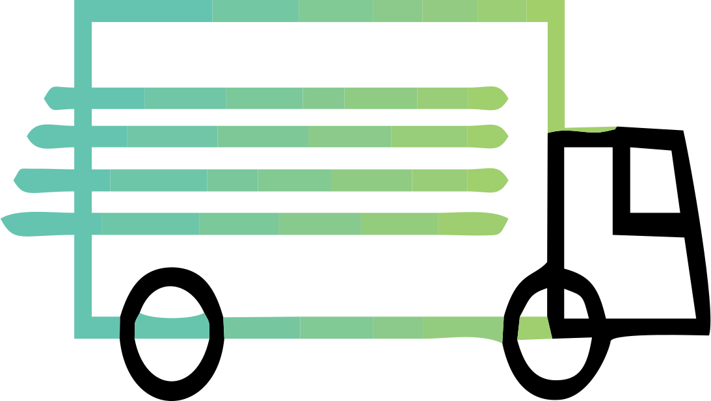
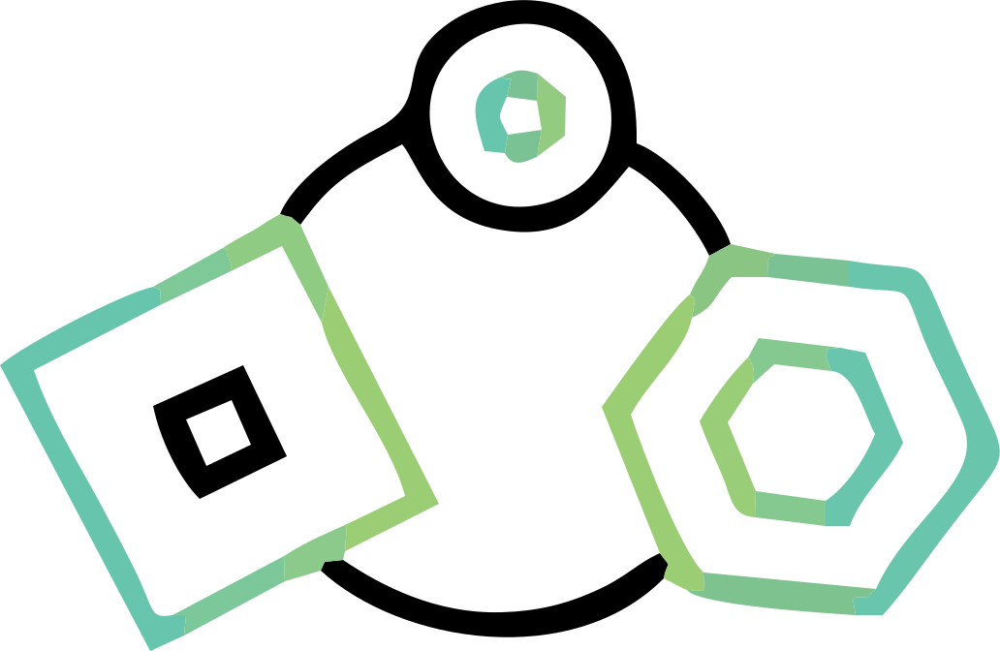
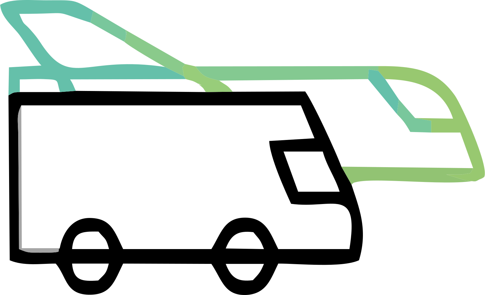

# Advanced, High-level Traffic and Fleet Management

<b>CONDUCTOR’s main goal</b>

To design, integrate and demonstrate advanced, high-level traffic and fleet management that will allow efficient and globally optimal transport of passengers and goods, while ensuring seamless multimodality and interoperability, through dynamic balancing and priority-based management of vehicles (automated and conventional).

## Demonstrating

<b>Traffic management</b>

<!--  -->

We will upgrade existing models and technologies to fit future mobility needs placing autonomous vehicles at the centre of future cities. The demonstrations, through mixed traffic orchestration, will mostly rely on public transportation, as the amount of private autonomous cars is still expected to be relatively low. The main driving force in demonstrations will be the consideration of users’ social needs.

<b>Fleet management</b>

Within the upgraded fleet simulation environment we aim to investigate fleet management scenarios for a multipurpose transport system combining passengers and goods transportation. The fleet control model (including public transit and logistics) will be coupled with a multi-resolution traffic simulation model to evaluate network-wide effects of the implemented fleet management strategies for demand-responsive mobility services for people and goods.

<b>Load balancing</b>

The proposed idea of ride-parcel-pooling aims at utilizing unused capacities by combining passengers and goods transportation flows within one transport system. We will also implement and evaluate cooperative routing strategies (social routing) for large scale CCAM vehicle fleets and aim at balancing the traffic loads on the overall road network.

<b>Multimodality</b>

The multi-modal system (combining different transportation modes such as pedestrians, connected/autonomous cars, motorcycles, taxis, delivery cargo vehicles, buses, etc.) will be optimised based on the user needs to ensure transport resilience and business continuity. Today’s city transport strategies are focusing on the efficient movement of people and goods and are prioritizing sustainable modes.

<!-- The CONDUCTOR project’s main goal is to design, integrate and demonstrate advanced, high-level traffic and fleet management that will allow efficient and globally optimal transport of passengers and goods, while ensuring seamless multimodality and interoperability. Using innovative dynamic balancing and priority-based management of vehicles (automated and conventional) CONDUCTOR will build upon state-of-the-art fleet and traffic management solutions in the CCAM ecosystem and develop next generation simulation models and tools enabled by machine learning and data fusion, enhancing the capabilities of transport authorities and operators, allowing them to become “conductors” of future mobility networks. We will upgrade existing technologies to place autonomous vehicles at the centre of future cities, allowing heightened safety and flexible, responsive, centralized control able to conduct traffic and fleets at a high level. These innovations will lead to less urban traffic and congestion, lowered pollution, and a higher quality of life. Project innovations will be integrated into a common, open platform, and validated in three use cases, testing the interoperability of traffic management systems and integration of different transportation means for both people and goods. Use case UC1 integrates traffic management with intermodality, UC2 tests demand-response transport, and UC3 urban logistics. In each use case and its demonstrations, simulations will be validated through real-life data -->